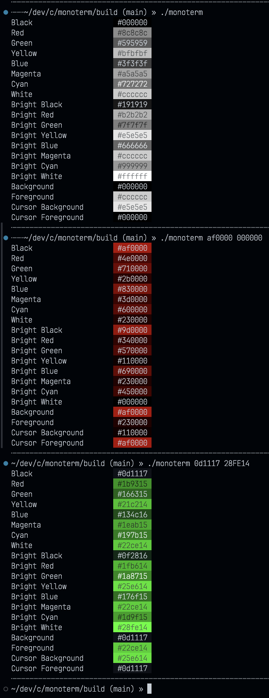

# Monoterm

Given a minimum and maximum colour, generates a monochromatic colour set, based on linear interpolation between the values and a scale, suitable for use in a terminal emulator colour scheme.

Inspired by the [Monochrome](https://github.com/anotherglitchinthematrix/monochrome) theme for Visual Studio Code.

## Example

